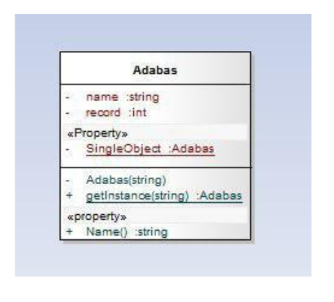

# Design-Patterns-Tutorial

## Desing Matters Part-three: Forever Single

|  | 
|:--:|
|*The Cover of Article is Adapted From “Design Patterns Explained Simply By Alexander Shvets” Cover Page*|

## Single Life Better Life

It is impossible that you have not encountered the issue of instantiation in the Object-Oriented world. From the very beginning of learning this science, you have created classes and made any number and size of objects from them, and in technical terms, you have created different instances of your desired classes. But has it ever occurred to you that there might be a situation where we only have to create one object from a class and we have to prevent creating objects from a class in more than one instance? Do you think there will ever be a situation where we reach this limit? And can Object-Oriented provide this possibility for us? And we really have to ask ourselves how much we have been able to understand Object-Oriented.

## Real-world Examples

If we want to give some examples from the real world in which we must have exactly one Object of the corresponding class, we can point to the following: We may have several Printer devices in a system, but we only have one Printer Spooler. Either we have only one File System in an Operating System or only one Window Manager or when we want to have only one access point to a Database Engine. To solve all these problems, the GOF book introduces a Design Pattern called __Singleton__, which is classified as a __Creational Design Pattern__.

## Get Familiar with Singleton Design Pattern

This design pattern ensures that a class has only one instance and provides a global point to access it.

|  | 
|:--:|

In the above figure, you can see the structure of this design pattern in the form of a class diagram.

## How Implement This Philosophy

Now, how can we use this Design Pattern to solve a problem whose Problem Domain corresponds to this Design Pattern and implement it? For this, there are different methods that we will examine some of these methods on an example.

## Lazy Initialization

Suppose we want to have only one admin for a particular network. To have only one object from the admin class, we first place a Private Variable inside the admin class, which makes an object accessible using a method. To optimize the work, we put the instantiation part of the object in the method so that the object can be instantiated when that method is called.

```
public class Admin {
  private static Admin instance;
  public static Admin getInstance(){
    if(this.instance == null){
      this.instance = new Admin();
    }
    return this.instance;
  }
}
```
Now we have to prevent the creation of an object by the class as a whole and for this, we have to make the constructor of this class private.

```
public class Admin {
  private static Admin instance;
  
  private Admin(){
  }
  
  public static Admin getInstance(){
    if(this.instance == null){
      this.instance = new Admin();
    }
    return this.instance;
  }
}
```
Well, so far everything is going well and it seems that if we use this class, there will be no problem for us and we will always have an object from the admin class during the lifetime of our program, but it's not true. Our suggestion to the readers is to go back and see the above code from the point of view of __concurrency__ and think about how the code cannot implement the concept of singleton and then continue reading this article.

## Now, What is the Issue?

The problem arises when we want to write our program in a multi-threaded way. Suppose we have two threads named t1 and t2. First, t1 calls the getInstance method. After checking the if condition and getting a true answer from the condition, it will be interrupted and then t2 will call the same method and do its job completely. When t2 calls that method and then completes its execution, our object is created. Now the interrupt is removed from t1 because it checked the condition before, it doesn't check it anymore and it creates the second object from the admin class and destroys the singleton philosophy.

The Java language has a solution to solve this problem by using the keyword __synchronized__ for the method we are considering. When a thread calls a synchronized method, no other thread can call that method until the thread that called the method is done, and our problem is solved in this part.

```
public class Admin{
  private static Admin instance;
  
  private Admin(){
  }
  
  public static synchronized Admin getInstance(){
    if(this.instance == null){
      this.instance = new Admin();
    }
    return this.instance;
  }
}
```
There are other solutions, such as __double-checked locking__, which can be a more optimal solution, and you can refer to the books introduced in the Bibliography section to learn more about this issue.

## Eager Initialization

In this approach, it is enough to act like the above and instead of instantiating the object in a mehtod, do this in the declaration part and proceed similar to the following code.

```
public class Admin {
  private static Admin instance = new Admin();

  private Admin(){
  }

  public static Admin getInstance(){
    return this.instance;
  }
}
```

## The Other Ways

There are other approaches for implementing this design pattern, and since our goal is to encourage you to study reference books, we refrain from describing those methods and leave it up to the reader to learn the other. You can learn them by referring to the sources introduced in the bibliography section.

###### List of other approaches

* Static block initialization
* Bill Pugh Singleton Implementation
* Using Reflection to destroy Singleton Pattern
* Enum Singleton
* Serialization and Singleton

## More Examples

Suppose we have a DBMS named ADABAS and we use it to record the weather conditions. We want this DBMS to have only one Admin. We have applied the necessary changes using the Singleton Pattern and have provided you with the class diagram and its source code in Java and C# code.
|  | 
|:--:|
