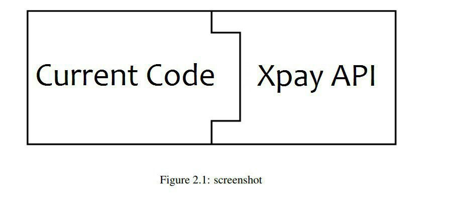
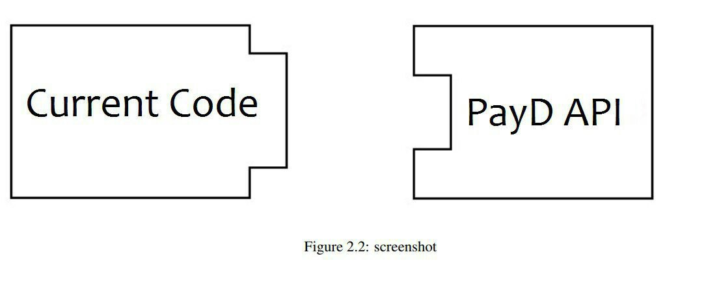
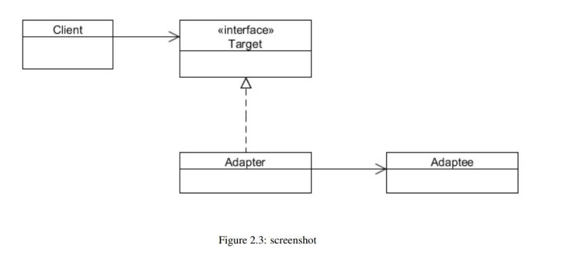
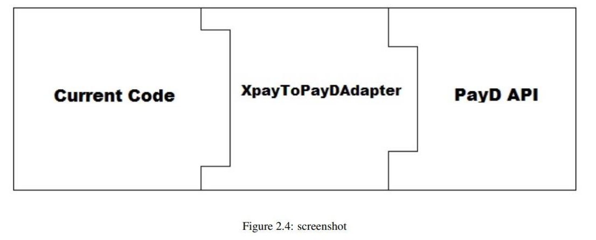
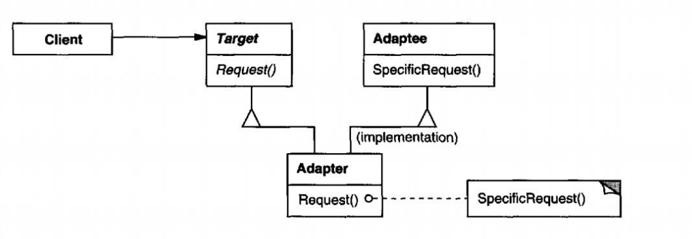

# Design-Patterns-Tutorial

## Desing Matters Part-two: Adapter Party

|  | 
|:--:|
|*The Cover of Article is Adapted From “Design Patterns Explained Simply By Alexander Shvets” Cover Page*|

## A Tales of Disease
Max is a programmer who works at NOTHING WORKS HERE Company. The company has a website that allows users to make payments and purchases online and it was integrated into a 3rd party payment gateway. 3rd party payment gateway means a payment gateway created by another vendor and we are using it to perform financial transactions. Therefore, users can pay their bills through their website with their credit cards. Everything was going well until Max's manager called him for changes in the project, and Max knew that what was about to happen was not pleasant at all.

The manager told him that they are planning to change the vendor of the payment gateway; thus, he needs to plan for possible changes in the code. The problem arose from the fact that the Site was attached to the __Xpay__ payment portal, which received an Xpay object. The name of the new vendor was __PayD__, which only allowed Processing on objects of the PayD type.

Max did not want to change all 100 classes that were referenced to an Xpay object. This would also increase the risk on the project that was running and the users were using it. Also, he cannot change the codes of the 3rd party payment portal. In other words, his problem can be described in the following two ways.

<p float="left">
  
   
</p>

## ‫‪Season‬‬‫‪Party‬‬ ‫‪Adapter‬‬
Well, as you can see, we have encountered a problem that is difficult to find a solution to it, not if we are not familiar with Pattern Designs. In this session, we want to introduce you to one of the most useful design patterns which are categorized by Structural purpose, The Adapter Pattern. In some books, it has been introduced as Wrapper Pattern. In General, an Adapter matches an interface(Adaptee) to another interface(Target); consequently, it results in an integrated abstraction from various interfaces.

An Adapter class does this by privately inheriting from an Adaptee class and causes multi-inheritance. We will cover this topic and the Object Adapter Pattern later.

You can have the same view on the Adapter as in the real world adapter In the real world, an adapter is used to connect two different electrical ports as connecting them can not be possible directly. The adapter relays between these two parts and gets the flow from one of them and transforms it to be usable for the other part. This work can not be done without an adapter because of the existence of Incompatible Interfaces.  

The Adapter pattern allows an object or a class to expose what it needs. It converts the interface of a class to its desired interface; in fact, it allows us to fix the interfaces between objects and classes without any need to change them directly.

## ‫‪Object Adapter Pattern and Believe Me... Its so easy to learn!

|  | 
|:--:|

Consider the above class diagram. An adapter uses composition to store an object that needs to be adapted to a new state and when a method has been called from an adapter, those calls will be transformed into things that adapted objects could understand, thus it passes all the callings to adapted objects. The adapter caller never needs to know whether the object is working on is the right one or not.

Now, before we continue the discussion, let's solve Max's problem.

## Max Knows about Patterns, Piece of Cake.

If we want to schematically show what Max has to do to solve the problem, something like the following will happen.

|  | 
|:--:|

Here, Adaptee is Xpay, whose object must be adapted, and Target Interface, which is PayD, must be implemented in Adapter.

###### Xpay Interface Code

```
public interface Xpay {
  public String getCreditCardNo();
  public String getCustomerName();
  public String getCardExpMonth();
  public String getCardExpYear();
  public Short getCardCVVNo();
  public Double getAmount();
  public void setCreditCardNo(String creditCardNo);
  public void setCustomerName(String customerName);
  public void setCardExpMonth(String cardExpMonth);
  public void setCardExpYear(String cardExpYear);
  public void setCardCVVNo(Short cardCVVNo);
  public void setAmount(Double amount);
}

```
###### Implementation of Xpay Interface Code

```
public class XpayImpl implements Xpay{
  private String creditCardNo;
  private String customerName;
  private String cardExpMonth;
  private String cardExpYear;
  private Short cardCVVNo;
  private Double amount;

  @Override
  public String getCreditCardNo() {
    return creditCardNo;
  }
  
  @Override
  public String getCustomerName() {
    return customerName;
  }
  
  @Override
  public String getCardExpMonth() {
    return cardExpMonth;
  }
  
  @Override
  public String getCardExpYear() {
    return cardExpYear;
  }
  
  @Override
  public Short getCardCVVNo() {
    return cardCVVNo;
  }
  
  @Override
  public Double getAmount() {
    return amount;
  }
  
  @Override
  public void setCreditCardNo(String creditCardNo) {
     this.creditCardNo = creditCardNo;
  }
  
  @Override
  public void setCustomerName(String customerName) {
    this.customerName = customerName;
  }
  
  @Override
  public void setCardExpMonth(String cardExpMonth) {
    this.cardExpMonth = cardExpMonth;
  }
  
  @Override
  public void setCardExpYear(String cardExpYear) {
    this.cardExpYear = cardExpYear;
  }

  @Override
  public void setCardCVVNo(Short cardCVVNo) {
    this.cardCVVNo = cardCVVNo;
  }

  @Override
  public void setAmount(Double amount) {
    this.amount = amount;
  }
}
```
###### PayD Interface Code

```
public interface PayD {
  public String getCustCardNo();
  public String getCardOwnerName();
  public String getCardExpMonthDate();
  public Integer getCVVNo();
  public Double getTotalAmount();
  public void setCustCardNo(String custCardNo);
  public void setCardOwnerName(String cardOwnerName);
  public void setCardExpMonthDate(String cardExpMonthDate);
  public void setCVVNo(Integer cVVNo);
  public void setTotalAmount(Double totalAmount);
}
```
###### Adapter Between Xpay and PayD Code

```
public class XpayToPayDAdapter implements PayD{
  private String custCardNo;
  private String cardOwnerName;
  private String cardExpMonthDate;
  private Integer cVVNo;
  private Double totalAmount;
  private final Xpay xpay;
  public XpayToPayDAdapter(Xpay xpay){
    this.xpay = xpay;
    setProp();
  }
  
  @Override
  public String getCustCardNo() {
    return custCardNo;
  }

  @Override
  public String getCardOwnerName() {
    return cardOwnerName;
  } 

  @Override
  public String getCardExpMonthDate() {
     return cardExpMonthDate;
  }

  @Override
  public Integer getCVVNo() {
    return cVVNo;
  }

  @Override
  public Double getTotalAmount() {
    return totalAmount;
  }

  @Override
  public void setCustCardNo(String custCardNo) {
    this.custCardNo = custCardNo;
  }

  @Override
  public void setCardOwnerName(String cardOwnerName) {
    this.cardOwnerName = cardOwnerName;
  }
  
  @Override
  public void setCardExpMonthDate(String cardExpMonthDate) {
    this.cardExpMonthDate = cardExpMonthDate;
  }

  @Override
  public void setCVVNo(Integer cVVNo) {
    this.cVVNo = cVVNo;
  }

  @Override
  public void setTotalAmount(Double totalAmount) {
    this.totalAmount = totalAmount;
  }

  private void setProp(){
    setCardOwnerName(this.xpay.getCustomerName());
    setCustCardNo(this.xpay.getCreditCardNo());
    setCardExpMonthDate(this.xpay.getCardExpMonth()+"/"+this.xpay. -
    getCardExpYear());
    setCVVNo(this.xpay.getCardCVVNo().intValue());
    setTotalAmount(this.xpay.getAmount());
  }
}
```
###### Testing the Adapter Code

```
public class RunAdapterExample {
  public static void main(String[] args) {
    // Object for Xpay
    Xpay xpay = new XpayImpl();
    xpay.setCreditCardNo("4789565874102365");
    xpay.setCustomerName("Max Warner");
    xpay.setCardExpMonth("09");
    xpay.setCardExpYear("25");
    xpay.setCardCVVNo((short)235);
    xpay.setAmount(2565.23);
    PayD payD = new XpayToPayDAdapter(xpay);
    testPayD(payD);
  }
  
  private static void testPayD(PayD payD){
    System.out.println(payD.getCardOwnerName());
    System.out.println(payD.getCustCardNo());
    System.out.println(payD.getCardExpMonthDate());
    System.out.println(payD.getCVVNo());
    System.out.println(payD.getTotalAmount());
  }
}
```
And in this way, Max was able to apply the changes that the manager wanted without changing the classes and objects.

## Class Adapter Pattern and Multi-inheritance Disease

Consider the class diagram of this pattern in the following.

|  | 
|:--:|
