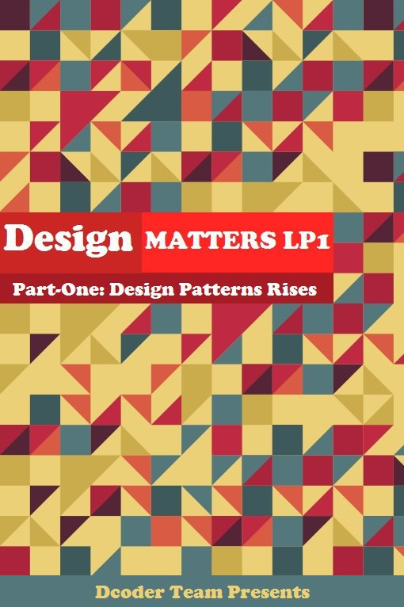

# Design-Patterns-Tutorial

## Desing Matters Part-one: Design Patterns Rises

|  | 
|:--:|
|*The Cover of Article is Adapted From “Design Patterns Explained Simply By Alexander Shvets” Cover Page*|

## Preface
At the beginning, it is necessary to say that this text is adapted from several reference books on the subject of Design Patterns, which we will mention to them at the end of this article, and the author of this article had no influence on its scientific content. I strongly recommend reading the sources.

## Why Design Pattern ?
Object-Oriented software design is a difficult task and reusable design is even more difficult. If you don't know anything about Object-Oriented, reading this article won't help you much, and it can be said that the prerequisite for learning Design patterns is mastering Object-Oriented concepts.
###### What is reusable design?
If you have programmed, you have noticed that at the end of programming, you have been able to give a solution to the problem that was in front of you, and if you have gained this experience many times, you will notice that you have encountered with the same problem domain which you have faced before and you were able to find a solution for it.
Now it may be a duplicate problem domain, but due to the different conditions and situation types, you have not been able to use the same previous solution for this repeated problem and you have had to find a new solution for it. In other words, it can be said that your design is not flexible and reusable, and it has caused you to provide different solutions for repetitive problems, and this is not a good thing. Our design must be reusable, and this is not the only feature of a good design, in fact, other factors such as elegant, flexible, and efficiency are among the other criteria of a good design.

Now, a question arises, how to deal with a new problem domain, taking into account the mentioned criteria, to make a design so that when we face the same problem again in the next work, we can get the desired solution with minimal changes in our previous solution? 

In response, it should be said that this is not an easy task at all and requires a lot of successful experience. It means that it becomes possible with the passage of time. You should record the experiences and results obtained after each design and use previous experiences repeatedly and improve your design skill, which is called Sprint-Retrospective, and finally become an expert object-oriented designer. You definitely don't have that much time to spend on gaining experience so that you can do a design with the mentioned criteria. This is where the issue of Design Pattern comes into play

## What is Design Pattern ?
There are a series of recurring problems in our world that we encounter many times. Experienced designers have found a solution for those problems once and forever. Each pattern represents a problem with its own solution, in other words, a design pattern must be the best practice for the relevant problem (that is, there is no better solution for that problem domain) and the duty of a designer is to do pattern matching, that is, to figure out which design pattern corresponds to the problem ahead.

## Characteristics of Design Pattern
1. It should be such that we no longer need to think about the problem and our only job is pattern matching. This property is called __Smart__.
2.  It should not be dependent on a specific type of system or programming language, it should be specific to a general problem domain, which is called __Generic__.
3. It must be proven that the proposed solution will definitely solve our problem and does not need to be proved again, which is called __well-proven__.
4. It should be __simple__.
5. It must be __Reusable__, which we explained earlier what it means.
6. All Design Patterns solutions are based on the __Object-Oriented paradigm__.

## Attention Please!
We recommend that you read the text again from the beginning and then continue.

## Design Patterns Structure
###### Each Design Pattern is made up of four basic parts that we will explain
1. Each Design Pattern has a __Name__ consisting of one or two words, from which one can understand the definition of Problem, Solution, and result (that is, a name related to what it does, not the name of its creator).
2. The second part is the __Problem__, which should explain the problem and its context, for example, how we can represent an algorithm in the form of an object. Sometimes the problem includes a list of conditions that must be checked whether they exist or not, and then according to the result, we decide whether this design pattern is useful or not.
3. The third part is ــSolutionــ, which introduces elements whose task is to make up the relationships, responsibilities, and collaborations of a design. Solutions do not have a specific implementation because they are like a template that is used in different situations and mostly include UML diagrams.
4. The fourth section is Consequences & Trade-off, which represents the result of a pattern. Basically, its role is to evaluate a design and determine the costs and benefits of using a design pattern.

## Design Patterns Classification 
Two items are used to classify design patterns. The first is __Purpose__, which reflects that a Design Pattern is placed in different categories in terms of what it does, all of which fall into three categories: ــCreational, Structural, and Behavioral, we will describe the characteristics of each category.
The next item is __Scope__, which specifies whether a Pattern is used in Class format or Object format. Those that are placed in Class Scope work with the relationship between classes and subclasses, like the Inheritance concept, they are also static and fixed at compile-time, but those that are in Object Scope work with the relationship between objects. They can change in Run-time and are dynamic
